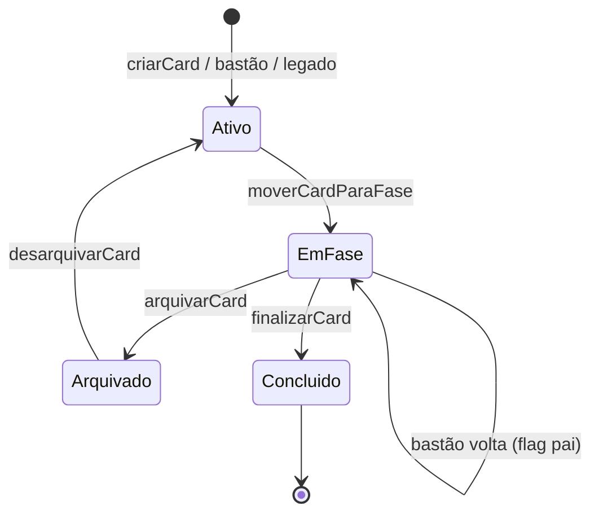
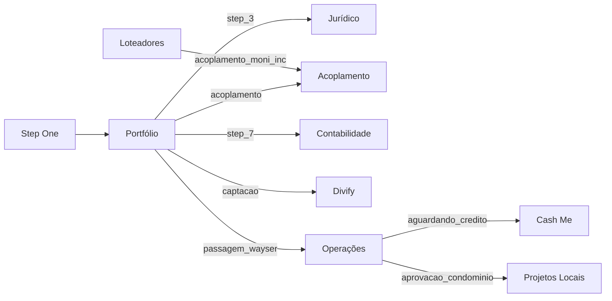
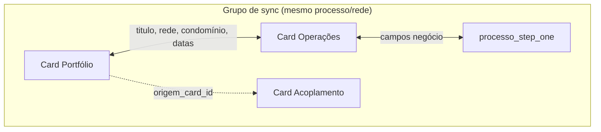

# Inventário completo — Kanban / Funil (moni-fly)

## Índice

1. [Resumo por funil](#1-resumo-por-funil)
2. [Camada de banco de dados](#2-camada-de-banco-de-dados)
3. [Constantes e IDs](#3-constantes-e-ids)
4. [Estrutura de fase](#4-estrutura-de-fase)
5. [Estrutura de card](#5-estrutura-de-card)
6. [Vínculos e esteiras](#6-vínculos-e-esteiras)
7. [Gates e validações](#7-gates-e-validações)
8. [UI / páginas por funil](#8-ui--páginas-por-funil)
9. [Automações e cron](#9-automações-e-cron)
10. [Legado vs nativo](#10-legado-vs-nativo)
11. [Permissões](#11-permissões)
12. [Diagramas](#12-diagramas)
13. [Índice de arquivos](#13-índice-de-arquivos)
14. [Receita: criar novo funil](#14-receita-criar-novo-funil)

---

## 1. Resumo por funil

| Nome DB (`kanbans.nome`) | Rota app | UUID (`KANBAN_IDS`) | # fases (aprox.) | UI | Recursos especiais |
|---|---|---|---:|---|---|
| Funil Step One | `/funil-stepone` | `4d89f111-…` | 12 | Custom (`KanbanBoard` + `KanbanTabs`) | Checklists ricos (condomínios, mapa, BCA, pré-batalha); auto-cura cards da rede; chips Portfolio |
| Funil Portfólio | `/portfolio` | `c57120a0-…` | 10 | `renderKanbanDatabasePage` | Esteiras paralelas; chips paralelas (informativos); bastões ida/volta; **gate de esteiras pendentes removido** (commit `f0d97ea6`) |
| Funil Acoplamento | `/funil-acoplamento` | `15847602-…` | 6+ | Shared | Gate modelagem Gbox; fases Aprovado/Reprovado/Paralisados; tag no pai |
| Funil Contabilidade | `/painel-contabilidade` | `26d1c83c-…` | 4 | **Híbrido** (legado + nativo) | Query param `kanbanCard`; bastão de volta `contabilidade_ok` |
| Funil Cash Me | `/funil-credito-obra` | `6463af1d-…` | 25 | **Híbrido** | SLA pausado em documentação; tranches 2ª–6ª; bastões de volta |
| Funil Loteadores | `/loteadores`, `/funil-moni-inc` | `3e7b6ec7-…` | 14+ | Custom | Link externo; SLA justificativa; bastão Acoplamento; **gate Comitê exige Acoplamento**; título por condomínio |
| Funil Operações | `/operacoes` | `f6bba1de-…` | ~10 | Shared | Pré-obra `prev_*`; tranche vínculos; abertura automática Cash Me |
| Funil Jurídico | `/funil-juridico` | `35fb5c8d-…` | 3+ | Shared | Spawn manual/automático; interno |
| Funil Divify | `/funil-moni-capital` | `724aef36-…` | 9 | Shared | Conta Bancária + checklist 464; nomes/instruções 465; interno |
| Funding | `/funil-funding` | `7c9e4a21-…` | 7 | Shared | Colunas `funding_*` no card; interno |
| Funil Contratações | `/funil-contratacoes` | `5f40aa71-…` | — | Shared | Interno |
| Funil Produto | `/funil-produto` | `a9e61d76-…` | — | Shared | Bastão → Modelo Virtual em `prod_publicado`; interno |
| Funil Modelo Virtual | `/funil-modelo-virtual` | `92d0033b-…` | — | Shared | Interno |
| Funil Homologações | `/funil-homologacoes` | `69bf5668-…` | — | Shared | Interno |
| Funil Projeto Legal | `/funil-projeto-legal` | `39de341d-…` | 14 | Shared | Bastão de volta move pai Operações; interno |
| Funil Projetos Locais | `/projetos-locais` | `c2ab09bd-…` | — | Shared | Bastão de `aprovacao_condominio`; interno |
| Funil Projetos Legais | `/projetos-legais` | `23ad5ce1-…` | — | Shared | Interno |
| *(legado)* painel Step One | `/painel-novos-negocios` | — | colunas fixas | `processo_step_one` | Não é kanban nativo; view de compatibilidade |

---

## 2. Camada de banco de dados

### 2.1 Tabelas principais

| Tabela | Propósito |
|---|---|
| `kanbans` | Registro do board (`nome`, `ordem`, `cor_hex`, `ativo`, `descricao`) |
| `kanban_fases` | Colunas (`nome`, `slug`, `ordem`, `sla_dias`, `sla_tipo`, `instrucoes`, `materiais`, `fase_conversao`, `ativo`) |
| `kanban_cards` | Cards nativos |
| `kanban_card_vinculos` | Relacionamentos card↔card (`tipo_vinculo`, slugs origem/destino) |
| `kanban_fase_checklist_itens` | Itens de checklist por fase (tipo, obrigatório, template) |
| `kanban_fase_checklist_respostas` | Respostas por card+item |
| `kanban_historico` | Auditoria (triggers): `card_criado`, `fase_avancada`, `fase_retrocedida`, etc. |
| `kanban_card_comentarios` | Comentários no card |
| `kanban_atividades` | Interações/atividades no card (Sirene integrado) |
| `kanban_tags` / `kanban_card_tags` | Tags customizadas |
| `kanban_aprovacoes_fase` | Solicitações de aprovação (bombeiro) com checklist pendente |
| `kanban_checklist_itens` | Checklist legado por card (não por fase) |
| `kanban_times` | Catálogo de times Moní |
| `kanban_card_form_tokens` | Links públicos de formulário |
| `kanban_card_atas_reuniao` | Atas de reunião |
| `kanban_operacoes_tranche_vinculos` | Presets de tranche (Operações → Cash Me) |
| `kanban_loteador_externo_tokens` | Link externo Loteadores |
| `processo_step_one` | Legado Step One / fonte de sync |

### 2.2 Colunas importantes em `kanban_cards`

| Coluna | Significado |
|---|---|
| `franqueado_id` | Dono do card (`auth.users`) — RLS base |
| `rede_franqueado_id` | Vínculo à rede; sync group; responsável de fase |
| `rede_loteador_id` | Funil Loteadores |
| `projeto_id` | `projeto_negocio` (Portfolio) ou `processo_step_one` |
| `processo_step_one_id` | FK explícita ao processo (migration 324) |
| `origem_card_id` | Card pai (bastão spawn) |
| `origem_kanban_id` | Funil que disparou bastão automático (389) |
| `condominio_id`, `nome_condominio`, `quadra`, `lote` | Localização do negócio |
| `ordem_coluna` | Ordenação DnD na coluna |
| `arquivado`, `arquivado_em`, `arquivado_por`, `motivo_arquivamento` | Arquivamento |
| `concluido`, `concluido_em`, `concluido_por` | Finalização |
| `entered_fase_at` | Entrada na fase atual (SLA) |
| `sla_iniciado_em` | Início efetivo do SLA (ex.: após docs Cash Me) |
| **Flags paralelas** | `acoplamento_concluido`, `credito_terreno_ok`, `credito_obra_ok`, `contabilidade_ok`, `juridico_ok`, `capital_ok`, `projetos_locais_ok`, `projetos_legais_ok` |
| `acoplamento_filho_fase_slug/nome` | Tag no card pai (Portfolio) |
| `alvara_url`, `docs_terreno_url` | Cash Me — SLA pausado |
| `motivo_reprovacao_acoplamento` | Acoplamento → Paralisados |
| `funding_*` | Campos específicos Funding |
| `prev_*`, `condominio_aprovada_em`, `alvara_emitido_em` | Pré-obra Operações |
| `hora_reuniao` | Loteadores / reunião |
| `tag_especial` | Tag visual global (migration 407) |

### 2.3 Padrão de migration para novo funil

Referência: `supabase/migrations/419_kanban_funding.sql`

```sql
-- 1. Colunas específicas (se houver) em kanban_cards
ALTER TABLE kanban_cards ADD COLUMN IF NOT EXISTS ...;

-- 2. INSERT kanban com UUID fixo (alinhar kanban-ids.ts)
INSERT INTO kanbans (id, nome, descricao, ativo) SELECT 'uuid'::uuid, 'Nome', '...', true
WHERE NOT EXISTS (...);

-- 3. INSERT fases com slug, ordem, sla_dias, sla_tipo, fase_conversao, instrucoes
INSERT INTO kanban_fases (...) SELECT k.id, f.* FROM kanbans k CROSS JOIN (VALUES ...) AS f(...)
WHERE k.nome = '...' AND NOT EXISTS (...);

-- 4. Seed checklist (kanban_fase_checklist_itens)
-- 5. NOTIFY pgrst, 'reload schema';
```

### 2.4 RLS (resumo)

- **`kanban_cards`**: SELECT/INSERT/UPDATE/DELETE — dono (`franqueado_id`) OU `admin`/`consultor`/`team` (evoluído em 368)
- **`kanbans` / `kanban_fases`**: SELECT público; escrita admin
- **`kanban_historico`**: SELECT via acesso ao card; escrita só triggers
- **`kanban_card_vinculos`**: SELECT autenticado; escrita admin/consultor
- **`kanban_fase_checklist_*`**: SELECT autenticado; itens admin-only para escrita estrutural

---

## 3. Constantes e IDs

Fonte canônica: `src/lib/constants/kanban-ids.ts`

- **`KANBAN_IDS`**: 17 UUIDs fixos (PROD)
- **`KANBAN_ID_BY_NOME`**: mapa nome DB → UUID (inclui aliases legados)
- **`FASE_IDS`**: UUIDs de fases-gatilho (Portfolio Step 3/4/7, Acoplamento terminais, etc.)
- **`FASE_SLUGS`**: slugs de todas as fases relevantes para bastões/gates
- **`KANBANS_INTERNOS`**: funis ocultos para Frank (filtros, esteiras)
- **`KANBANS_COM_CHAMADO_JURIDICO`**: Portfolio, Loteadores, Operações
- **`PORTFOLIO_FASES_CONFIRMACAO_SAIDA`**: Opção, Comitê, Contrato (migration 389)

---

## 4. Estrutura de fase

### 4.1 Campos

| Campo | Uso |
|---|---|
| `nome` | Label da coluna |
| `slug` | Identificador estável (bastões, gates, deep link) |
| `ordem` | Posição no board |
| `sla_dias` | Prazo (úteis por default; `corridos` em Operações em_obra/aguardando_credito) |
| `sla_tipo` | `uteis` \| `corridos` |
| `instrucoes` | HTML no modal (aba Instruções) |
| `materiais` | JSONB links/docs/vídeos |
| `fase_conversao` | Marca fase de conversão (387) |
| `ativo` | `false` = fase desativada mas cards podem existir |

### 4.2 Checklist por fase

- **DB**: `kanban_fase_checklist_itens` + `kanban_fase_checklist_respostas`
- **UI**: `FaseChecklistCard.tsx` — tipos: `texto_curto`, `texto_longo`, `email`, `telefone`, `numero`, `anexo`, `anexo_template`, `checkbox`
- **Nota**: `atividade-times-responsaveis.ts` é para **atividades/interações** (times/responsáveis), não checklist de fase
- Seeds por funil: migrations `241–328` (Step One), `344–365` (Loteadores), `209` (Jurídico/Contab), etc.

### 4.3 Fases por funil (slugs principais)

**Step One (12)**: `onboarding` → `dados_candidato` → `dados_cidade` → `mapa_competidores` → `dados_condominios` → `lotes_disponiveis` → `batalha` (Pré Batalha) → `configurador_casas` → `bca` → `batalha_casas` → `escolha` → `hipoteses`

**Portfólio (10)**: `step_2`, `aprovacao_moni_novo_negocio`, `step_3`/`opcao`, `step_4`, `acoplamento`, `step_5`, `step_6`, `step_7`, `captacao_moni_capital`, `passagem_wayser`

**Acoplamento**: `modelagem_terreno`, `modelagem_casa_gbox`, `validacao_acoplamento`, `alteracoes_acoplamento`, `acoplamento_aprovado`, `acoplamento_reprovado` (+ Paralisados)

**Operações**: `planialtimetrico`, `projeto_legal`, `aprovacao_condominio`, `aprovacao_prefeitura`, `revisao_bca`, `processos_cartorarios`, `aguardando_credito`, `em_obra`, `operacoes_entregue`

**Cash Me (25)**: `co_novo_projeto` … `co_acompanhamento_6a` → `credito_obra_aprovado` / `credito_obra_reprovado`

**Loteadores (14+)**: `primeiro_contato_moni_inc` … `contrato_parceria_moni_inc` (+ `viabilidade_moni_inc`, `execucao_material_moni_inc`, `diligencia_moni_inc` em versões recentes)

**Divify (9)**: `capital_recebimento` → `capital_abertura_spe` → `capital_abertura_conta` (Conta Bancária) → `capital_cadastro_plataforma` → `capital_materiais_projeto` → `capital_informacoes_obrigatorias` → `capital_formalizacao` → `capital_concluido` (Oferta publicada) / `capital_nao_elegivel` — migrations 464–465

**Funding (7)**: `funding_leads` … `funding_contrato`

**Projeto Legal (14)**: `pl_nova_demanda` … `pl_pagamentos`

---

## 5. Estrutura de card

### 5.1 Caminhos de criação

| Caminho | Onde |
|---|---|
| Modal "+ Novo card" | `KanbanWrapper` → `card-actions.criarCardKanban` |
| Spawn filho (bastão) | `kanban-bastoes.criarCardFilho` |
| Esteira manual | `dispararEsteiraManualDoCard` / `KanbanCardModalRelacionamentos` |
| Auto Step One | `ensure-funil-stepone-card-from-rede.ts` (staff, ao abrir funil) |
| Legado | `processo_step_one` via `v_processo_como_kanban_cards` |

### 5.2 Sync group (`card-sync-group.ts`)

**Campos sincronizados em `kanban_cards`**: `titulo`, `rede_franqueado_id`, `nome_condominio`, `condominio_id`, `quadra`, `lote`, `data_reuniao`, `data_followup`, `hora_reuniao`

**Campos sincronizados em `processo_step_one`**: ~40 campos de negócio/pré-obra (VGV, links BCA, previsões, etc.)

**Não sincronizados**: `fase_id`, `kanban_id`, `status`, flags paralelas, `arquivado`, `concluido`, `origem_card_id`, `sla_*`

**Título canônico** (`montarTituloCardSync`):
```
FK#### - Nome Condomínio - Quadra - Lote
```

### 5.3 Responsável

- `franqueado_id`: dono RLS (user auth)
- `rede_franqueado_id`: rede do franqueado; usado em sync e responsável de fase
- `responsavel_fase` / `responsavel_da_fase`: checklist por fase (migrations 380–406)

### 5.4 Chips paralelas (`kanban-paralelas-chips.ts`)

Exibidos no Portfolio (a partir de `step_4`/`acoplamento`) e Step One (a partir de Hipóteses): Acoplamento, Créd. Terreno, Contab., Jurídico, Divify, Operações.

> **Nota (commit `f0d97ea6`)**: no Funil Portfólio, os chips são **apenas informativos** — não bloqueiam mais o avanço para Comitê (`step_5`).

### 5.4.1 Bolinhas de vínculo (Operações)

Tabela funil/esteira → bolinha → critério pintada (`kanban-paralelas-chips.ts`):

| Funil (pai) | Esteira / bolinha | Exibe | Condição de exibição | Critério pintada (concluído) |
|---|---|---|---|---|
| Funil Pré Obra e Obra | Projeto Legal | Sim | Fase `projeto_legal` ou filho existente | Filho ativo existe |
| Funil Pré Obra e Obra | Projetos Legais | Sim | Fase `projeto_legal` ou `projetos_legais_ok` presente | `projetos_legais_ok = true` |
| Funil Pré Obra e Obra | Projetos Locais | Sim | Fase `aprovacao_condominio` ou `projetos_locais_ok` presente | `projetos_locais_ok = true` |

### 5.5 Arquivar / desarquivar / finalizar

- `arquivarCard` / `desarquivarCard` — permissão `arquivar_cards` ou staff
- `finalizarCard` — permissão `finalizar_cards`
- Legado: desarquivar pode não ter row em `kanban_cards`

### 5.6 Deep links (`kanban-card-href.ts`)

Mapa `kanbans.nome` → `{ basePath, cardQueryParam }`. Contabilidade e Cash Me usam `kanbanCard`; demais usam `card`.

---

## 6. Vínculos e esteiras

### 6.1 `esteira-manual-destinos.ts`

| Key | Destino | Fase inicial |
|---|---|---|
| `acoplamento` | Funil Acoplamento | `modelagem_terreno` |
| `contabilidade` | Contabilidade | `contabilidade_incorporadora` |
| `credito_obra` | Cash Me | `co_novo_projeto` |
| `juridico` | Jurídico | `juridico_recebimento` |
| `moni_capital` | Divify | `capital_recebimento` |
| `projeto_legal` | Projeto Legal | `pl_nova_demanda` |

**Quem pode disparar**:
- Portfolio/Operações: todos exceto Acoplamento (Acoplamento tem botão dedicado)
- Loteadores/Operações/Jurídico: jurídico + projeto legal + cash me
- Demais: projeto legal + cash me

### 6.2 Bastões de IDA (`executarBastoes` em `kanban-bastoes.ts`)

| Fase slug (pai) | Destino |
|---|---|
| `step_3` | Jurídico |
| `acoplamento` / `acoplamento_moni_inc` | Acoplamento |
| `step_7` | Contabilidade SPE |
| `captacao_moni_capital` | Divify |
| `passagem_wayser` | Operações planialtimétrico |
| `aguardando_credito` | Cash Me |
| `prod_publicado` | Modelo Virtual |
| `aprovacao_condominio` | Projetos Locais |
| `projeto_legal` | Funil Projeto Legal (`pl_nova_demanda`) |
| `projeto_legal` | Funil Projetos Legais (`projetos_legais_protocolo`) |
| `loteador_juridico` | Jurídico |

### 6.3 Bastões de VOLTA (`executarBastaoDeVolta`)

| Fase slug (filho) | Flag no pai |
|---|---|
| `acoplamento_aprovado/reprovado` | `acoplamento_concluido` |
| `co_outro_parceiro`, `credito_obra_aprovado/reprovado` | `credito_obra_ok` |
| `contabilidade_concluido` | `contabilidade_ok` |
| `juridico_concluido` | `juridico_ok` |
| `capital_concluido/nao_elegivel` | `capital_ok` |
| `projetos_locais_concluido` | `projetos_locais_ok` |
| `projetos_legais_concluido` | `projetos_legais_ok` |

**Especial**: filho Projeto Legal em `pl_c_protocolo_andamento` → move pai Operações para `aprovacao_condominio`.

### 6.4 Tranche vínculos (Operações)

Tabela `kanban_operacoes_tranche_vinculos` + UI `KanbanCardModalOperacoesTrancheVinculos.tsx` — presets 2ª–6ª tranche ligam card Operações a filhos Cash Me.

---

## 7. Gates e validações

Em `moverCardParaFase` (`card-actions.ts`):

| Gate | Condição |
|---|---|
| **Gate esteiras Portfólio (Comitê `step_5`)** | **Removido** (commit `f0d97ea6`) — chips são informativos no Portfólio, sem bloqueio de fase. |
| **Gate Comitê Loteadores** | `verificarGateComiteLoteadores` / `obterGateComiteLoteadores` — **ativo**; exige `acoplamento_concluido = true` antes de avançar para Comitê |
| **Acoplamento Gbox** | `verificarGateAcoplamentoModelagemCasa` — link Gbox preenchido |
| **Checklist Legal** | `verificarGateChecklistLegalPortfolio` — checklist legal condomínio completo |
| **SLA Loteadores** | `verificarGateJustificativaSlaLoteadores` — justificativa ao sair com SLA vencido |
| **Acoplamento Reprovado** | `motivoReprovacaoAcoplamento` obrigatório |
| **Passagem Wayser** | checklist específico (passagem_wayser) |
| **Confirmação saída** | Opção, Comitê, Contrato (389) — modal de confirmação na UI |

> **Histórico**: `obterGateComiteLoteadores` é chamado em `moverCardParaFase`; para o Funil Portfólio retorna `{ ok: true }` sem validar flags paralelas. Para Loteadores, `verificarGateComiteLoteadores` valida `acoplamento_concluido` via `deveValidarGateLoteadoresComite`.

Após mover: `executarBastoes`, `executarBastaoDeVolta`, SLA docs Cash Me, propagar responsável de fase, notificar universidade.

---

## 8. UI / páginas por funil

### 8.1 Padrões de página

| Padrão | Funis |
|---|---|
| `renderKanbanDatabasePage` | Portfólio, Operações, Acoplamento, Jurídico, Divify, Funding, Contratações, Produto, Modelo Virtual, Homologações, Projeto Legal, Projetos Locais/Legais |
| **Custom page** | Step One, Loteadores (`/loteadores`), Moní INC (alias) |
| **Híbrido legado+nativo** | Contabilidade, Cash Me, painel-novos-negocios |

### 8.2 `fetchKanbanBoardSnapshot`

1. Resolve kanban por nome
2. Carrega fases ativas (+ augment de fases órfãs com cards)
3. Cards nativos de `kanban_cards`
4. Merge com `v_processo_como_kanban_cards` (Portfólio, Operações, Contabilidade, Crédito legado)
5. Enriquece: paralelas, responsável fase, títulos sync, SLA cols

### 8.3 `KanbanCardModal` — seções

- **Esquerda**: título editável, chips paralelas, datas, condomínio, dados negócio, pré-obra, funding, calculadora fases, checklist fase (`FaseChecklistCard`), checklist legal/crédito, atas
- **Direita**: mover fase, arquivar, finalizar, relacionamentos/esteiras, interações Sirene, comentários, histórico, tags
- **`portalFrank=true`**: oculta gestão (arquivar, mover, email, relacionamentos admin)

### 8.4 Filtros (`kanbanBoardFiltros.ts`)

- Fase, responsável (`eu`/nome), SLA (`atrasados`/`vence_hoje`/`dentro_prazo`), status (`ativos`/`arquivados`/`concluidos`)
- Busca normalizada (NFD)

### 8.5 Painel performance

`PainelPerformance.tsx` — métricas por fase, origem legado/nativo.

---

## 9. Automações e cron

| Automação | Arquivo / rota |
|---|---|
| SLA alertas cards | `GET /api/cron/sla-alertas` → `sla-alertas.ts` |
| SLA atividades Sirene | mesmo cron → `sla-atividade-alertas.ts` |
| Bastões ao mover fase | `kanban-bastoes.ts` (chamado de `moverCardParaFase`) |
| Abertura automática Cash Me | `credito-obra-abertura-automatica.ts` (fase `aprovacao_prefeitura` em Operações) |
| Auto-card Step One | `ensure-funil-stepone-card-from-rede.ts` |
| Trigger `entered_fase_at` | migration 213 |
| Trigger histórico | migration 108/220 |
| Webhooks | `novo-franqueado` pode disparar criação de processo/card (não específico de kanban genérico) |

---

## 10. Legado vs nativo

| Aspecto | Legado | Nativo |
|---|---|---|
| Fonte | `processo_step_one` | `kanban_cards` |
| View | `v_processo_como_kanban_cards` | direto |
| `origem` no tipo | `'legado'` | `'nativo'` |
| Arquivar/concluir | via flags do processo | colunas `arquivado`/`concluido` |
| Fase | `etapa_painel` ↔ slug fase | `fase_id` |
| Painel antigo | `/painel-novos-negocios`, `/steps-viabilidade` | funis nativos |

Funis na view legado: Portfólio, Operações, Contabilidade, Crédito (nome antigo).

---

## 11. Permissões

Matriz: `permissoes_perfil` + `src/lib/permissoes-types.ts`

| Permissão | Uso |
|---|---|
| `mover_fase` | Drag-and-drop e botões de fase |
| `arquivar_cards` | Arquivar/desarquivar |
| `finalizar_cards` | Concluir card |
| `criar_cards` | Novo card |
| `vincular_cards` | Vínculos manuais |
| `editar_instrucoes` | Instruções de fase |

**Fallback staff**: `admin`, `team`, `consultor`, `supervisor` têm privilégios ampliados via `podeComFallbackStaff`.

**Frank (`portalFrank`)**: sem gestão de card; funis internos filtrados via `KANBANS_INTERNOS`.

**Esteira manual**: admin/team (verificado em `dispararEsteiraManualDoCard`).

---

## 12. Diagramas

### Ciclo de vida do card



### Bastões (esteira principal)



### Sync group



---

## 13. Índice de arquivos

| Caminho | Propósito |
|---|---|
| `src/lib/constants/kanban-ids.ts` | UUIDs, slugs, listas internas |
| `src/lib/actions/card-actions.ts` | CRUD card, mover fase, gates, aprovações |
| `src/lib/actions/kanban-bastoes.ts` | Bastões ida/volta, esteira manual, jurídico |
| `src/lib/kanban/card-sync-group.ts` | Sync group, título, processo |
| `src/lib/kanban/esteira-manual-destinos.ts` | Destinos esteira |
| `src/lib/kanban/portfolio-paralelas.ts` | Flags paralelas; `deveValidarGateLoteadoresComite` (gate Comitê Loteadores) |
| `src/lib/kanban/kanban-paralelas-chips.ts` | Chips no board/modal |
| `src/lib/kanban/kanban-card-href.ts` | Deep links |
| `src/lib/kanban/kanban-card-sla.ts` | Cálculo SLA |
| `src/lib/kanban/checklist-legal-gate.ts` | Gate checklist legal |
| `src/lib/kanban/ensure-funil-stepone-card-from-rede.ts` | Auto-card Step One |
| `src/lib/actions/credito-obra-abertura-automatica.ts` | Abertura Cash Me |
| `src/lib/kanban/sla-alertas.ts` | Cron SLA |
| `src/components/kanban-shared/KanbanBoard.tsx` | Board DnD |
| `src/components/kanban-shared/KanbanCardModal.tsx` | Modal principal |
| `src/components/kanban-shared/FaseChecklistCard.tsx` | Checklist por fase |
| `src/components/kanban-shared/KanbanCardModalRelacionamentos.tsx` | Esteiras/vínculos |
| `src/components/kanban-shared/fetchKanbanBoardSnapshot.ts` | Load board |
| `src/components/kanban-shared/renderKanbanDatabasePage.tsx` | Template página |
| `src/components/kanban-shared/kanbanBoardFiltros.ts` | Filtros |
| `src/components/PortalSidebar.tsx` | Navegação funis |
| `src/lib/supabase/middleware.ts` | Rotas protegidas |
| `supabase/migrations/091_step_one_kanban.sql` | Schema base |
| `supabase/migrations/419_kanban_funding.sql` | Template funil novo |

---

## 14. Receita: criar novo funil

- [ ] **1. Migration SQL** — UUID fixo em `kanbans`, fases com `slug`, checklist seed, colunas específicas em `kanban_cards` se necessário
- [ ] **2. `kanban-ids.ts`** — adicionar em `KANBAN_IDS`, `KANBAN_ID_BY_NOME`, `FASE_SLUGS` (se bastões)
- [ ] **3. `types.ts`** — `KanbanNomeDisplay`
- [ ] **4. `page.tsx`** — `renderKanbanDatabasePage` ou custom; `basePath` único
- [ ] **5. `kanban-card-href.ts`** — mapear nome DB → rota
- [ ] **6. `PortalSidebar.tsx`** — item de menu (+ grupo interno se aplicável)
- [ ] **7. `middleware.ts`** — rota em `PROTECTED_ROUTES` / release scope
- [ ] **8. Bastões** (se integrar esteira) — `BASTOES_DE_IDA` / `DESFECHO_FLAG_POR_FASE` em `kanban-bastoes.ts`
- [ ] **9. Esteira manual** (se aplicável) — `esteira-manual-destinos.ts`
- [ ] **10. Chips paralelas** (se pai Portfolio) — `portfolio-paralelas.ts` / `kanban-paralelas-chips.ts`
- [ ] **11. `KANBAN_APP_BASE_PATHS`** — revalidação após mutações
- [ ] **12. Rodar migration DEV** + `NOTIFY pgrst, 'reload schema'`
- [ ] **13. Testar**: criar card, mover fase, checklist, permissões Frank vs staff

---

## Achados principais

1. **17 funis nativos** registrados em `kanban-ids.ts`, cada um com UUID fixo de PROD — não alterar manualmente.

2. **Três padrões de UI**: shared (`renderKanbanDatabasePage`), custom (Step One, Loteadores) e híbrido legado+nativo (Contabilidade, Cash Me, painel-novos-negocios).

3. **Esteira principal** conecta Portfólio → funis paralelos via **bastões automáticos** ao entrar em fases-gatilho; **flags booleanas** no card pai registram retorno.

4. **Sync group** replica título/localização/datas entre cards do mesmo processo e ~40 campos em `processo_step_one` — fase e flags **não** sincronizam.

5. **`atividade-times-responsaveis.ts`** não é o checklist de fase — o checklist estrutural vive em `kanban_fase_checklist_*` + `FaseChecklistCard.tsx`.

6. **Gates críticos**: Acoplamento Gbox, Checklist Legal, SLA Loteadores, confirmação de saída (Opção/Comitê/Contrato). **Gate esteiras Portfólio (Comitê) removido** em `f0d97ea6` — chips informativos; **`verificarGateComiteLoteadores`** (Loteadores → Comitê, exige `acoplamento_concluido`) permanece ativo.

7. **Frank** não vê funis internos (`KANBANS_INTERNOS`) e no portal tem `portalFrank` que desabilita gestão do card.

8. **Template de migration** mais recente e completo: `419_kanban_funding.sql` (kanban + fases + colunas card).
