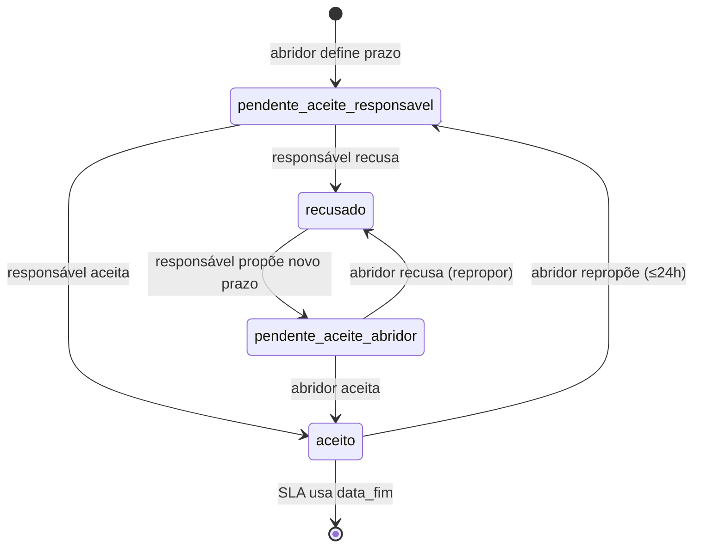

# Negociação de prazo em atividades

## Entidades

- **Sub-atividade:** `sirene_topicos` (`data_fim` = prazo oficial após aceite)
- **Chamado sem sub (legado):** `kanban_atividades.data_vencimento` (mesmas colunas `prazo_*`)

## Máquina de estados

| Estado | Quem age | Efeito em `data_fim` |
|--------|----------|----------------------|
| `pendente_aceite_responsavel` | Responsável aceita/recusa | `NULL` (SLA não conta) |
| `recusado` | Responsável propõe | `NULL` |
| `pendente_aceite_abridor` | Abridor aceita | `NULL` até aceite |
| `aceito` | — | `data_fim` = `prazo_proposto` |

## Janela de 24h

- `prazo_negociacao_expira_em` = criação da atividade + 24h (ou primeira abertura da negociação).
- Após expirar: campo de data **travado** para não-admin; apenas `adminOverridePrazoSubInteracao`.

## SLA

- `prazoIsoEfetivoSla()` / `data_fim` só entram no cálculo com `prazo_status = 'aceito'`.
- Propostas pendentes aparecem na UI, mas não geram atraso.

## Auditoria

Eventos em `sirene_topicos.historico`: `Prazo aceito`, `Prazo recusado`, `Prazo proposto`, `Prazo alterado (admin)`.
